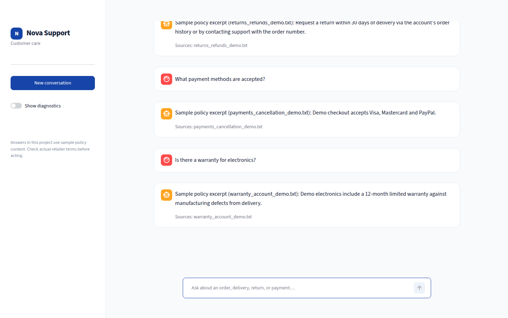

# E-Commerce Customer Support RAG Pipeline

## Project Overview

An existing FastAPI and Streamlit e-commerce assistant extended with a document-grounded knowledge base. The included policy text is **fictional demo data**, not official policy of any retailer. With an API key, answers are generated through the existing OpenRouter integration; Ollama is intentionally not used. Without a key, the app shows a labeled excerpt from the closest retrieved passage for a transparent offline demo. Do not treat sample answers as actual customer commitments.

[Watch the running demo](files/project_demo.webm) · [View the current UI screenshot](files/demo_preview.png)

## Features

Document-backed RAG with filename/page citations, multilingual language detection, few-shot intent and sentiment/tone classification, empathetic responses and an advisory human-escalation flag. The Streamlit frontend is a focused customer chat with a new-conversation control, visible sources, loading/error states, and optional diagnostics behind a toggle. **No support ticket is actually created** by the demo application. The optional DistilRoBERTa sentiment fallback requires an untracked checkpoint; without it, OpenRouter sentiment is used and missing classification defaults to neutral.

## Architecture

```text
TXT/PDF demo documents → extraction + OCR warnings → cleaning → 700-character chunks
→ SentenceTransformer (all-MiniLM-L6-v2) → persistent ChromaDB
→ retriever → labeled context → OpenRouter generation → FastAPI /query or /chat
→ Streamlit chat with visible source citations
                  /chat also: language → intent/sentiment → escalation routing
```

The diagram above is the current document-backed architecture. The existing [UI screenshot](image.png) is historical: it shows an older interface that simulated creating tickets; the current demo explicitly avoids that claim.

## Tech Stack

Python 3.10, FastAPI, Pydantic, Streamlit, SentenceTransformers, ChromaDB, PyPDF, scikit-learn, optional PyTorch/Transformers sentiment fallback, OpenRouter via the OpenAI SDK, pytest, pandas and Jupyter.

## Project Structure

```text
app/                 FastAPI, pipeline, classifiers, RAG and document loader
prompts/             intent/greeting and grounded-answer prompts
frontend/            Streamlit customer UI and diagnostics
scripts/             repeatable document-index build
notebooks/           rag_pipeline.ipynb: ingestion through evaluation
data/raw/            clearly labeled fictional TXT policy samples (also supports PDF)
data/vector_store/   generated local Chroma index and config (gitignored)
Model_pickle/        existing language and BiLSTM models/tokenizer; RoBERTa optional
Training/            existing classical-model training notebook
tests/               existing and added API/RAG tests
files/               recorded Streamlit demo and current UI preview
environment.yml      existing Conda environment
requirements.txt     pip dependencies
Dockerfile           backend container
image.png            historical UI screenshot (ticket simulation is no longer shown)
```

## Dataset / Document Corpus and RAG Pipeline

Four small synthetic TXT files cover shipping/delivery, damaged or missing orders, returns/refunds, payments/cancellation, warranty and account help. This corpus is explicitly for development/testing; replace it with approved real policies before deployment. The loader accepts UTF-8 TXT and text-based PDFs. Image-only PDF pages are flagged for OCR (OCR is not automated). It normalizes layout whitespace, splits each page into ~700-character passages with 100-character overlap, preserves filename/page/chunk ID, embeds with all-MiniLM-L6-v2 and persists in Chroma. Retrieval supplies source-labeled passages to the existing OpenRouter prompt, which requires grounded answers and source references. The API returns sources separately too. No vectors are rebuilt per API request.

## Setup

```bash
git clone https://github.com/YoussefWael18/Ecommerce_simple_chatbot.git
cd Ecommerce_simple_chatbot
python3.10 -m venv .venv
source .venv/bin/activate
python -m pip install -r requirements.txt
cp .env.example .env
# Set OPENROUTER_API_KEY in .env for live generation and intent classification.
python scripts/build_vector_store.py
uvicorn app.main:app --reload
```

In a second terminal, activate the same environment and run:

```bash
streamlit run frontend/streamlit_app.py
```

The existing `environment.yml` may alternatively be used with `conda env create -f environment.yml`; install the additional `pypdf`, `streamlit`, `requests`, `nbformat`, `nbclient`, `ipykernel` dependencies from requirements.txt when using Conda.

## Environment Variables

| Variable | Purpose |
| --- | --- |
| `OPENROUTER_API_KEY` | Secret required for live OpenRouter calls; legacy `openrouter` also works |
| `API_BASE_URL` | Required Streamlit backend URL (example `http://localhost:8000` in `.env.example`) |
| `CORS_ORIGINS` | Comma-separated frontend origins; defaults to local Streamlit ports |

No actual key belongs in Git. Without an OpenRouter key, the generator returns a clearly labeled retrieved excerpt, and intent classification defaults to `out_of_scope`/neutral instead of making a network call. The recorded demo uses this **offline mode**; it demonstrates live retrieval and source display, not OpenRouter answer quality. With a key, the current model configured in `app/config.py` is `minimax/minimax-m3:free`; availability on OpenRouter can change.

## Build Vector Store

Place `.txt`/`.pdf` files in `data/raw/` and run `python scripts/build_vector_store.py`. Re-run after edits and **restart the backend**; the script upserts deterministic IDs and removes stale chunks. Generated files in `data/vector_store/` are intentionally excluded from Git. The notebook also builds the same collection and writes `config.json`.

## Run Backend and Frontend

Run `uvicorn app.main:app --reload` in one terminal and `streamlit run frontend/streamlit_app.py` in another, after activating the environment in each.

FastAPI initializes expensive resources once at startup. Streamlit sends `/chat` requests to the configured backend, shows a loading spinner and handles HTTP errors. Its escalation indicator is advisory only.

## API Reference

- `GET /health` → `{"status":"ok","models_loaded":[...],"vector_store_documents":4}` (count depends on corpus).
- `POST /query` with `{"question":"How long do refunds take?"}` → `{"answer":"...","sources":["returns_refunds_demo.txt"]}`. Empty/missing question returns 422.
- `POST /chat` with `{"message":"How do I request a refund?"}` → `{"response":"...","language":"en","sentiment":"neutral","intent":"billing_refunds","escalate":false,"sources":["returns_refunds_demo.txt"],"retrieved_chunks":[...]}`. Existing fields remain; source fields were added. Empty text returns 400.

Requests to `/query` bypass intent routing; `/chat` preserves existing routing. A greeting may have no sources because it uses a canned reply. A citation identifies retrieved evidence, not proof that a live model faithfully used it.

## Notebook and Evaluation

Run `jupyter nbconvert --to notebook --execute --inplace notebooks/rag_pipeline.ipynb` from the repository root (or Kernel → Restart & Run All). It displays ingestion/parse issues, chunk metadata, ten retrieval queries and a pandas evaluation table. In the executed demo notebook, the expected policy file appears among the top three results for **10/10 questions** (5 indexed chunks, 4 documents, 0 parsing issues). This does not mean rank-one retrieval is perfect. Live answer correctness/grounding must be manually reviewed with a configured OpenRouter key; the notebook explicitly marks these as *not evaluated* without one. Do not interpret retrieval relevance as an answer-quality score.

## Testing

```bash
pytest tests/ -v
```

Tests mock remote LLM calls and cover the existing `/chat` behavior, `/health`, `/query`, document parsing, retrieval and routing. Some embedding tests download the SentenceTransformer model on first run.

Local validation on 2026-09-16: **62 passed, 2 warnings**. The warnings concern Starlette's deprecated portal alias and an existing pytest class-scoped fixture pattern; neither failed a test.

## Docker

```bash
docker build -t ecommerce-rag .
docker run --rm -p 8000:8000 --env-file .env ecommerce-rag
```

The container builds its document index at launch; mount a persistent `data/vector_store` volume for repeated launches in production. Neither API credentials nor generated vector files are copied into the image.

## Screenshots

The current UI preview and short recording are in `files/`:



[Play the project demo](files/project_demo.webm). The roughly one-minute recording shows four questions sent through the live Streamlit/FastAPI stack and the sources returned by ChromaDB. The OpenRouter key was unavailable, so the displayed answer text is a retrieved excerpt, not an LLM-generated answer. The [older screenshot](image.png) records a prototype that simulated tickets; the current demo does not create tickets.
