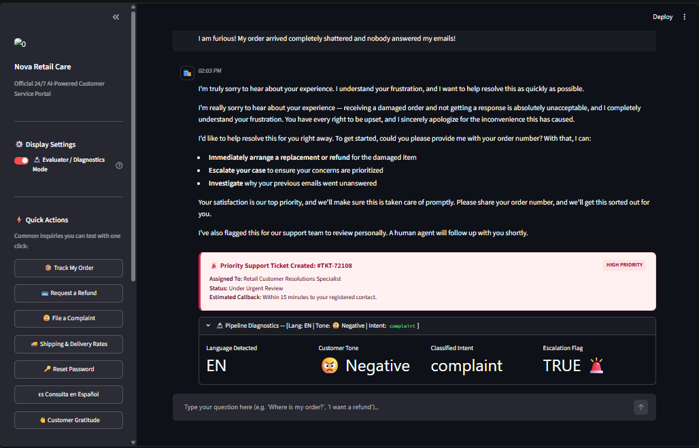

# 🛍️ RAG-Based E-Commerce Customer Support Chatbot

An end-to-end, multi-stage NLP conversational pipeline designed for e-commerce customer support. The system delivers grounded, tone-aware, and multilingual responses across orders, refunds, deliveries, complaints, and account inquiries.

---

## 📌 Architecture Overview



The chatbot processes every customer message through **four integrated stages** before delivering a response:

1. **Language Detection (`app/models/language_detector.py`)**: Identifies customer input language (`en`, `es`, `de`, `fr`) using TF-IDF feature extraction and Multinomial Naive Bayes so the system can retrieve support documents and reply in the user's language.
2. **Sentiment & Emotional Tone Analysis (`prompts/intent_prompt.py` & `app/models/intent_classifier.py`)**: Evaluates the customer's emotional state (`negative`, `neutral`, `positive`) to dynamically adjust response tone (e.g., injecting empathy for angry customers).
3. **Intent Classification (`prompts/intent_prompt.py`)**: Classifies the query into one of 7 core retail support groups via few-shot LLM prompting.
4. **Intelligent Router & RAG Knowledge Retrieval (`app/pipeline.py` & `app/rag/`)**:
   - **Small Talk / Greetings** ➔ Instant canned response (0 API cost, 0 latency).
   - **Dissatisfaction / Complaints** ➔ Empathetic apology + RAG policy lookup + Human Escalation ticket (`escalate: true`).
   - **Inquiries with Negative Sentiment** ➔ Prepend empathy prefix before answering.
   - **Standard Inquiries** ➔ Cosine similarity search over 26,872 retail support pairs in ChromaDB + Context-Grounded generation via OpenRouter LLM.

---

## 🔬 Evolution: Earlier Methodology vs. Refinement

### 1. Earlier Methodology
In initial iterations, sentiment and emotion analysis were treated as isolated supervised machine learning tasks:
- **Models Trained**:
  - A 2-layer Bidirectional LSTM (`BiLSTMClassifier`) with embedding layers.
  - A fine-tuned DistilRoBERTa model (`roberta_sentiment.pkl`) trained on standard emotion classification benchmarks (such as `dair-ai/emotion`).
- **The Challenge (Severe Domain Shift)**:
  - Emotion datasets like `dair-ai/emotion` are collected from personal blog posts and social media (Twitter) where emotion labels (`sadness`, `anger`, `joy`, `fear`) correlate with dramatic, expressive prose.
  - When applied to e-commerce customer inquiries, the model suffered from severe **domain shift**. Neutral, factual questions such as:
    > *"What are your delivery options and hours?"*
  - Were falsely classified as **`negative` with 91.9% confidence**, causing the system to unnecessarily apologize to calm customers and misroute standard questions.

### 2. The Refinement: In-Prompt Emotional Classification
Rather than retraining traditional models on expensive domain-specific retail emotion datasets, we refined the architecture:
- **Joint Intent & Tone In-Prompt Classification**: We unified intent classification and emotion detection into a structured, few-shot system prompt executed via OpenRouter LLM (`minimax/minimax-m3:free`).
- **Strict Emotional Guidelines**:
  - `negative`: The customer is frustrated, angry, upset, disappointed, impatient, or making a complaint.
  - `neutral`: Factual question, calm inquiry, or standard informational request.
  - `positive`: Customer is satisfied, happy, polite, praising, or expressing gratitude.
- **Accurate Grounding**: Standard queries like *"What delivery options do you offer?"* are now reliably classified as `neutral`, while genuinely angry queries like *"My package arrived shattered and your support is useless!"* correctly trigger the `negative` emotional flag and human escalation.
- **Graceful Fallback**: The offline fine-tuned DistilRoBERTa model is retained as a local fallback if external network calls are unavailable.

---

## 📂 Repository Structure

```text
├── app/
│   ├── config.py                 # Central configurations, model paths, and API keys
│   ├── main.py                   # FastAPI application (POST /chat, GET /health)
│   ├── pipeline.py               # 4-stage pipeline orchestrator & router
│   ├── models/
│   │   ├── language_detector.py  # Sklearn Pipeline (TF-IDF + MultinomialNB)
│   │   ├── sentiment.py          # DistilRoBERTa & BiLSTM sentiment models
│   │   └── intent_classifier.py  # Few-shot intent & emotion classifier via OpenRouter
│   └── rag/
│       ├── embedder.py           # SentenceTransformer (all-MiniLM-L6-v2)
│       ├── vector_store.py       # Persistent ChromaDB client with cosine search
│       ├── retriever.py          # Dense retrieval & metadata extraction
│       └── generator.py          # Grounded context generation via OpenRouter
├── data/
│   └── chroma_db/                # ChromaDB persistent store (26,872 indexed items)
├── frontend/
│   └── streamlit_app.py          # Production Streamlit support portal with dual-mode UI
├── prompts/                      # Dedicated system prompt modules (.py)
│   ├── intent_prompt.py          # Few-shot prompt for 7 intents + emotional tone
│   ├── rag_prompt.py             # Grounded generation prompt + empathy guidelines
│   └── greeting_responses.py     # Canned responses for small talk & gratitude
├── scripts/
│   └── build_vector_store.py     # One-time Bitext dataset download & ChromaDB builder
├── tests/
│   ├── test_api.py               # FastAPI endpoint tests
│   ├── test_intent_classifier.py # Few-shot prompt and classifier unit tests
│   ├── test_pipeline_integration.py # 4-stage routing & escalation integration tests
│   └── test_rag_pipeline.py      # Embedder, VectorStore, and Retriever tests
├── Model_pickle/                 # Pretrained weights and tokenizer
│   ├── 'lang_classifier .pkl'    # Language classifier pipeline
│   ├── bilstm_sentiment.pkl      # PyTorch BiLSTM weights
│   ├── roberta_sentiment.pkl     # PyTorch DistilRoBERTa checkpoint
│   └── roberta_tokenizer/        # Pre-extracted tokenizer configuration
├── environment.yml               # Conda environment definition
├── image.png                     # Architecture diagram
├── .env.example                  # Template for API credentials
└── README.md                     # Documentation
```

---

## 🛠️ Installation & Setup

### 1. Clone & Set Up Conda Environment
```bash
git clone https://github.com/your-username/ecommerce-rag-support-chatbot.git
cd ecommerce-rag-support-chatbot

# Create conda environment
conda create -n nlp-chatbot python=3.10 -y
conda activate nlp-chatbot

# Install dependencies
pip install -r environment.yml # Or use pip install:
pip install scikit-learn==1.6.1 torch transformers sentence-transformers chromadb fastapi uvicorn python-dotenv openai datasets pandas numpy pytest streamlit
```

### 2. Configure API Key
Create a `.env` file in the root directory:
```bash
cp .env.example .env
```
Edit `.env` and add your free OpenRouter API key:
```env
openrouter=your_openrouter_api_key_here
```

### 3. Build the ChromaDB Vector Store
Download and index all 26,872 instruction/response pairs from the Hugging Face `bitext/Bitext-customer-support-llm-chatbot-training-dataset`:
```bash
python scripts/build_vector_store.py
```
*Embeds all instructions using `all-MiniLM-L6-v2` and persists them into `data/chroma_db/`.*

---

## 🧪 Running the Tests

The repository includes a comprehensive test suite of **53 automated tests** with 100% pass rate:
```bash
pytest tests/ -v
```

Module-specific tests:
```bash
# Test few-shot intent and emotional classification
pytest tests/test_intent_classifier.py -v

# Test vector search and retriever grounding
pytest tests/test_rag_pipeline.py -v

# Test 4-stage routing and escalation logic
pytest tests/test_pipeline_integration.py -v

# Test FastAPI endpoints
pytest tests/test_api.py -v
```

---

## 🚀 Running the Services

### 1. Interactive Streamlit Web Portal (User-Ready UI)
Run the production customer support portal:
```bash
streamlit run frontend/streamlit_app.py
```
Open **[http://localhost:8501](http://localhost:8501)** in your browser:
- **🛍️ Retail Customer Concierge**: Clean, modern interface with message timestamps and status indicator.
- **🚨 Automated Priority Tickets**: Automatically generates interactive priority support tickets (`#TKT-XXXXX`) when customer requests escalation or expresses severe frustration.
- **🔬 Evaluator / Diagnostics Mode**: Toggle on to view real-time NLP telemetry (Detected Language, Sentiment Badge, Intent Group, and Retrieved Knowledge Base passages with similarity distances).
- **⚡ 1-Click Inquiry Presets**: Quickly test order tracking, refund requests, angry complaints, password resets, and Spanish queries.
- **📥 Transcript Export**: Download complete support transcripts as `.txt` files.

### 2. FastAPI Backend Server
Start the REST API:
```bash
uvicorn app.main:app --host 0.0.0.0 --port 8000 --reload
```
Interactive Swagger documentation is available at **[http://localhost:8000/docs](http://localhost:8000/docs)**.

#### Sample `POST /chat` Request:
```bash
curl -s -X POST http://127.0.0.1:8000/chat \
  -H "Content-Type: application/json" \
  -d '{"message": "Can you help me check the delivery options for my order?"}' | python3 -m json.tool
```

#### Response:
```json
{
  "response": "Here are the delivery options we offer:\n\n1. **Standard Shipping** – 3-5 business days.\n2. **Expedited Shipping** – 2 business days.\n3. **Overnight Delivery** – Next business day.\n\nWould you like me to check the options for a specific order number?",
  "language": "en",
  "sentiment": "neutral",
  "intent": "order_status",
  "escalate": false,
  "retrieved_chunks": [...]
}
```

---

## 👥 Contributors & Academic Context
Developed as part of the **NLP Final Project 2026** focusing on multi-component RAG systems, domain adaptation, and context-grounded conversational AI.

